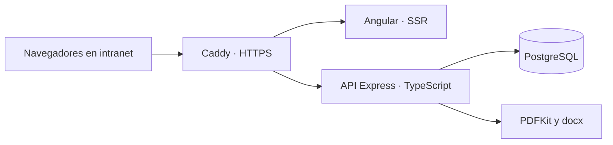

<p align="center">
  
</p>

# Sistema de Informes Técnicos · UMSS


[](https://github.com/FabriCordovaCaceres/informes-umss/actions/workflows/ci.yml)

Aplicación web para elaborar informes técnicos de requerimiento de materiales. Centraliza el catálogo, organiza cantidades por área y genera documentos PDF y Word a partir de la información guardada.

Pensada para una oficina: una computadora aloja la aplicación y PostgreSQL, y los usuarios trabajan desde sus navegadores en la intranet.

## Funcionalidades

| Módulo | Alcance |
| --- | --- |
| Informes | Editor por pasos, borradores, validación, finalización y duplicación. |
| Materiales | Catálogo de 62 materiales con 346 atributos y fichas técnicas versionadas. |
| Especificaciones | Personalización por informe sin modificar la ficha original del catálogo. |
| Documentos | Vista previa A4, exportación PDF y Word con tablas editables. |
| Usuarios | Roles de administrador, técnico y jefatura; cambio obligatorio de claves temporales. |
| Historial | Registro de cambios y control de versión para evitar sobrescribir ediciones simultáneas. |

## Recorrido de trabajo

1. Iniciar sesión y cambiar la contraseña temporal.
2. Crear un informe con sus datos generales y áreas.
3. Seleccionar materiales, cantidades y especificaciones.
4. Guardar el borrador, revisar la vista previa y finalizar.
5. Descargar PDF o Word; consultar el historial o duplicar el informe.

## Arquitectura



La API concentra validaciones, permisos y transacciones. Cada material usado en un informe referencia una revisión de su ficha: actualizar el catálogo conserva el contenido de los documentos anteriores. Las exportaciones se generan bajo demanda.

```text
informes-umss/
├── frontend/                 # Angular, editor y panel de gestión
│   ├── src/app/core/          # Sesiones, servicios, modelos y guards
│   ├── src/app/features/      # Pantallas de cada módulo
│   ├── src/app/shared/        # Componentes e impresión A4
│   └── deploy/               # Caddy y guías de intranet/Windows
├── backend/src/              # API, reglas de negocio y exportación
├── database/                 # Migraciones, catálogo y extracción
├── docs/                     # Instalación y documentación técnica
└── .github/workflows/        # Compilación y pruebas automáticas
```

## Ejecutar localmente

Requisitos: Node.js compatible con Angular 22 (22.22.3+, 24.15+ o 26+) y PostgreSQL 14 o posterior. La [guía de instalación](docs/DEVELOPMENT.md#1-postgresql-local) explica cómo crear la base de datos y configurar el entorno.

```bash
git clone https://github.com/FabriCordovaCaceres/informes-umss.git
cd informes-umss
cp backend/.env.example backend/.env
# Configure DATABASE_URL y SEED_ADMIN_PASSWORD en backend/.env.
npm ci --prefix backend
npm ci --prefix frontend
npm run migrate --prefix backend
npm run seed --prefix backend
```

Inicie la API y Angular en terminales separadas:

```bash
npm run dev --prefix backend
```

```bash
npm start --prefix frontend
```

Abra **http://localhost:4200** e ingrese con el usuario `admin` y la contraseña inicial configurada. El primer ingreso exige elegir una nueva contraseña. Las cuentas de ejemplo y la numeración inicial se describen en la [guía de desarrollo](docs/DEVELOPMENT.md).

## Verificación

```bash
npm run build --prefix backend
npm test --prefix backend
npm run build --prefix frontend
npm test --prefix frontend -- --watch=false
```

GitHub Actions ejecuta las compilaciones y las suites de pruebas del frontend y backend. La [prueba integral de API](docs/DEVELOPMENT.md#verificación) requiere una base PostgreSQL desechable y se ejecuta por separado.

## Documentación

- [Instalación, arquitectura, API y operación](docs/DEVELOPMENT.md)
- [Despliegue en intranet](frontend/deploy/README.md)
- [Equipo anfitrión con Windows 10](frontend/deploy/windows-10.md)
- [Fuentes y regeneración del catálogo](docs/README.md)

La versión pública utiliza nombres y cuentas de ejemplo. Los Word institucionales originales, las credenciales, los datos de PostgreSQL y sus respaldos están excluidos de Git. El catálogo técnico está incluido para permitir una instalación nueva.

Los informes finalizados se conservan sin edición; duplicarlos crea un borrador nuevo. El sistema no incluye firma digital ni un circuito de aprobación. La paginación puede variar entre PDF y Word.
